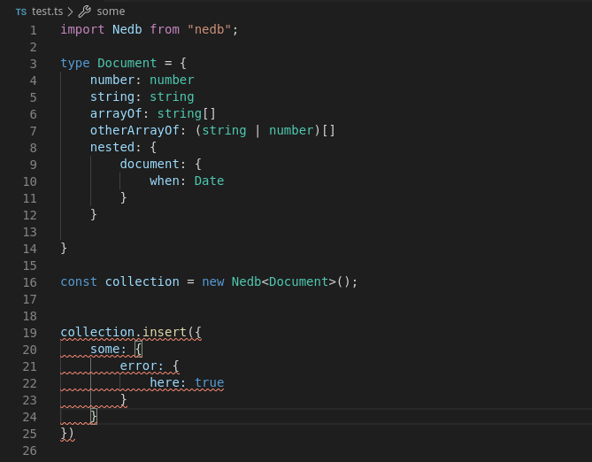

# Nedb Typescript Definitions
this is a work in progress if you have a comment open an issue in this repo

---
### Install
```sh
npm i ramiroaisen/nedb-types
```


---

### Usage
Types will be installed to @types/nedb so that's all you need to do
```typescript
import Nedb from "nedb"
const collection = new Nedb<MyAwesomeTypeHere>();
```
Now you have intellisense and all that good stuff

---

### Screenshots



